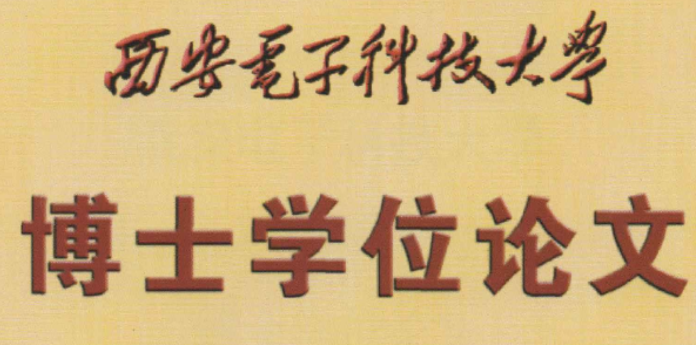

<a itemprop="sameAs" content="https://orcid.org/0000-0002-9423-9252" href="https://orcid.org/0000-0002-9423-9252" target="orcid.widget" rel="noopener noreferrer" style="vertical-align:top;">https://orcid.org/0000-0002-9423-9252</a>
   

## Biography
I'm Yang Liu (刘阳), a post-doctoral fellow at [HCP Lab](http://www.sysu-hcp.net/home/), [Sun-Yat-Sen University](http://www.sysu.edu.cn/) with co-advisor Prof. [Liang Lin](http://www.linliang.net/). Before that, I obtained my Ph.D degree in 2019 at [School of Telecommunications](http://ste.xidian.edu.cn/), [Xidian University](https://www.xidian.edu.cn/) advised by Prof. [Zhaoyang Lu](http://web.xidian.edu.cn/zhylu/). During my Ph.D study, I worked closely with Prof. [Jing Li](https://web.xidian.edu.cn/jingli/), Prof. [Tao Yang](https://scholar.google.com/citations?hl=en&user=Lvn4nH8AAAAJ) and Dr. [Chao Yao](https://scholar.google.com/citations?user=n6w02qoAAAAJ&hl=en). Before that, I received my Bachelor Degree in telecommunications from the School of Information Engineering, [Chang’an University](http://www.chd.edu.cn/) in 2014. My current research interests include computer vision and machine learning.  

## News  
**My [Ph.D Thesis](https://pan.baidu.com/s/1-Co8GcHEa7A1rST6oe171g) (psw：ithd) is available now!**       
My Ph.D Thesis is published online in [CNKI](https://www.cnki.net/).     
I received the Fundamental Research Funds for the Central Universities (RMB 120,000).     
Codes and datasets for IEEE TIP is [available](https://yangliu9208.github.io/DIVAFN/).    
One paper is accepted by IEEE Transactions on Image Processing.   
I start working as a postdoctoral fellow at Sun-Yat-Sen University.       
I obtain my Ph.D degree from Xidian University.   
I am invited to give a talk at The Second Session of Telecommunication Bridge.  
I obtain the National Scholarship for PhD Students (30,000 RMB).    
I am invited to give a talk at a Postgraduate Symposium.   
Codes for IEEE TCSVT is [available](https://yangliu9208.github.io/JSRDA/).  
One paper is accepted by IEEE Transactions on Circuits and Systems for Video Technology.   
Codes for IEEE SPL is [available](https://yangliu9208.github.io/TSTDDs/).  
One paper is accepted by IEEE Signal Processing Letters.  
Codes and datasets for Complexity is [available](https://yangliu9208.github.io/CDFAG/).  
One paper is accepted by Complexity.   
One paper is accepted by Journal of Xi'an Jiaotong University.  
One paper is accepted by Journal of Xi'an Jiaotong University.  
One paper is accepted by Chinese Conference on Biometric Recognition.  

## Research interests   
Video Analysis and Understanding, Human Action Recognition        
Multi-modal/Cross-domain Representation Learning,Transfer Learning   
Deep Learning, Attention modeling, Knowledge Distillation    
Cognitive Reasoning, Knowledge Graph Embedding, Graph Neural Networks   
Communication Systems Design in Intelligent Transportation     

## Selected Publications 

          <a>
            
          </a> 

***Cross-domain Human Action Recognition via Transfer Learning, 2019.*** [[pdf]](https://pan.baidu.com/s/1-Co8GcHEa7A1rST6oe171g)(psw：ithd) [[Defense Talk]]((https://yangliu9208.github.io/home/))    
**Yang Liu**    
**PhD thesis, Xidian University, June 30, 2019.**   
Committee: Zhaoyang Lu, Jing Li, Quanxue Gao, Peiyi Shen, Guizhong Liu, Chun Qi.  

          <a>
            
          </a> 

***Deep Image-to-Video Adaptation and Fusion Networks for Action Recognition*** [[pdf]](https://ieeexplore.ieee.org/document/8931264/)[[codes]](https://yangliu9208.github.io/DIVAFN/)             
**Yang Liu**, Zhaoyang Lu, Jing Li, Tao Yang, Chao Yao.    
**IEEE Transactions on Image Processing, accepted. doi: 10.1109/TIP.2019.2957930 (CCF-A, JCR 1, IF:6.790)**   
(*A Novel Cross-modal Adaptation Framework that utilize image features to improve the performance of video action recognition.*)  

          <a>
            
          </a> 

***Hierarchically Learned View-Invariant Representations for Cross View Action Recognition*** [[pdf]](https://ieeexplore.ieee.org/document/8453034)[[codes]](https://yangliu9208.github.io/JSRDA/)     
**Yang Liu**, Zhaoyang Lu, Jing Li, Tao Yang.  
**IEEE Transactions on Circuits and Systems for Video Technology, 2019. (CCF-B, JCR 1, IF:4.046)**  
(*A Novel Cross-view Action Recognition Framework for learning view-invariant representations.*)  
  

          <a>
            
          </a> 

***Global Temporal Representation based CNNs for Infrared Action Recognition*** [[pdf]](https://ieeexplore.ieee.org/document/8332532)[[codes]](https://yangliu9208.github.io/TSTDDs/)          
**Yang Liu**, Zhaoyang Lu, Jing Li, Tao Yang, Chao Yao.   
**IEEE Signal Processing Letters, 2018.  (CCF-C, JCR 2, IF:3.268)**   
(*A novel Optical-flow stacked difference image is proposed to capture global temporal information for infrared action recognition.*)  

          <a>
            
          </a> 

***Transferable Feature Representation for Visible-to-Infrared Cross-Dataset Human Action Recognition*** [[pdf]](http://downloads.hindawi.com/journals/complexity/2018/5345241.pdf)[[codes]](https://yangliu9208.github.io/CDFAG/)       
**Yang Liu**, Zhaoyang Lu, Jing Li, Chao Yao, Yanzi Deng.  
**Complexity, 2018. (JCR 1, IF:4.621)**      
(*The first work that uilize visible light videos as an aid to improve the infrared action recognition performance. And a visible light action dataset XD145 is built.*)   

          <a>
            
          </a> 

***Combining Multiple Features for Cross-Domain Face Sketch Recognition***[[pdf]](https://link.springer.com/chapter/10.1007/978-3-319-46654-5_16)        
**Yang Liu**, Jing Li, Zhaoyang Lu,Tao Yang, Zijian Liu.  
**Chinese Conference on Biometric Recognition (CCBR), 2016.**   
(*My first academic paper, which uses simple multi-feature fusion method to address cross-domain face sketch recognition problem.*)  

## Other Publications   

A Geometric Segmentation Method for Traffic Scenes Using Super-Pixel Label Matching  
Jiangce Hu, Zhaoyang Lu, Jing Li, Yanzi Deng, **Yang Liu**.  
**Journal of Xi'an Jiaotong University, 2018.**  
 
Road Scene Segmentation Using Hierarchical Graph-based Inference  
Yanzi Deng, Zhaoyang Lu, Jing Li, **Yang Liu.**  
**Journal of Xi'an Jiaotong University, 2017.**  

## Patents (in Chinese) 
[1] 卢朝阳，邓顺，李静，**刘阳**，许琼. "一种对装有车载监控终端的车辆监控系统及其方法". 国家发明专利CN106600951B    
[2] 卢朝阳，许琼，李静，邓顺，**刘阳**. " 车辆监控系统的统计报表生成方法". 国家发明专利CN106682232A  

## Academic services 
**Reviewer for**   
IEEE Transactions on Cybernetics  
IEEE Transactions on Circuits and Systems for Video Technology  
International Conference on Computer Science and Application Engineering   
Control and Decision   

## Selected honors & awards  
2018 National Scholarship for PhD Students  
2018 Excellent PhD Students      
2017 First Class Academic Scholarship for PhD Students  
2015 Second Class Academic Scholarship for Master Students   
2013 Third Prize of National English Competition   
2012 Second Prize in National Mathematical Modeling Contest

 
