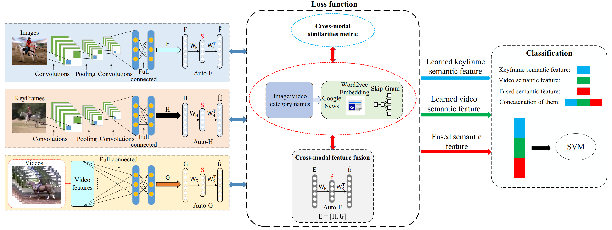
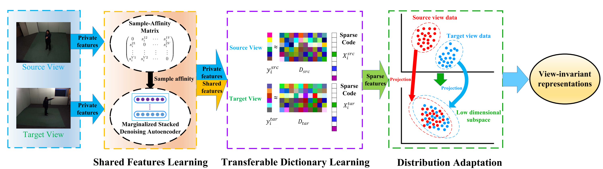
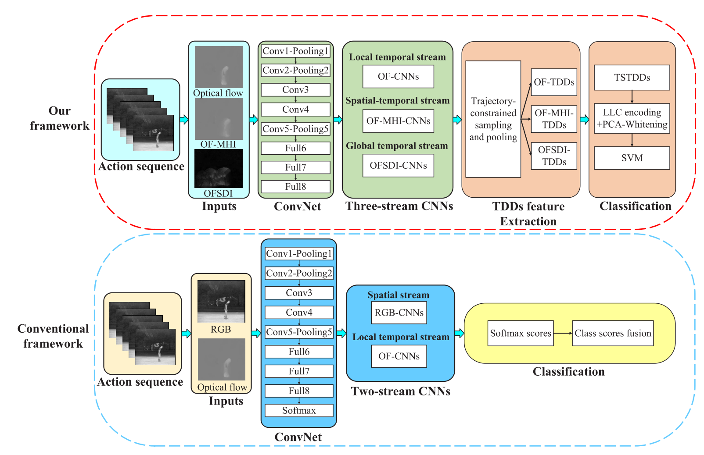
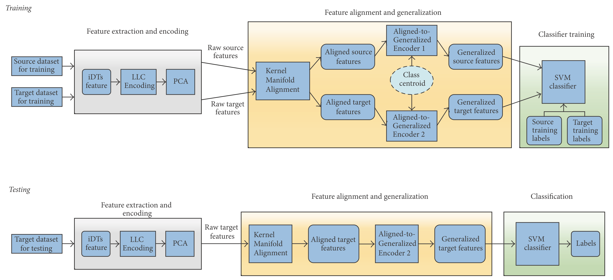
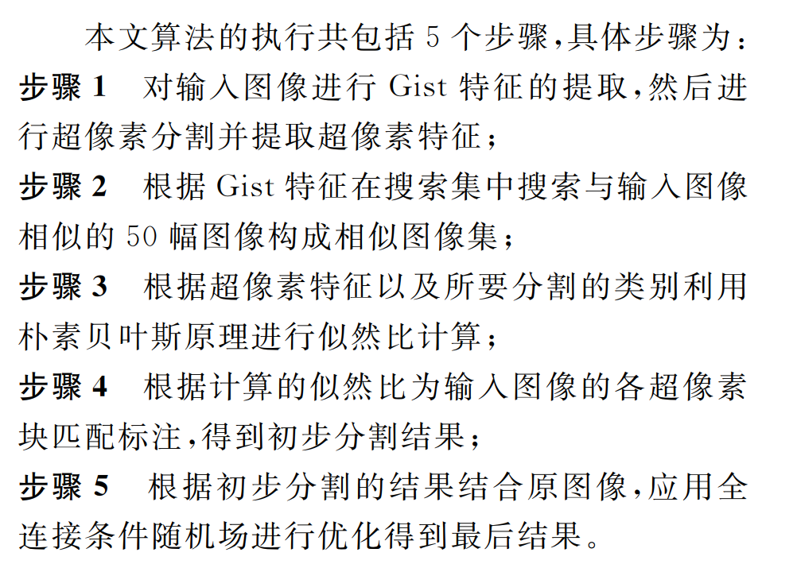
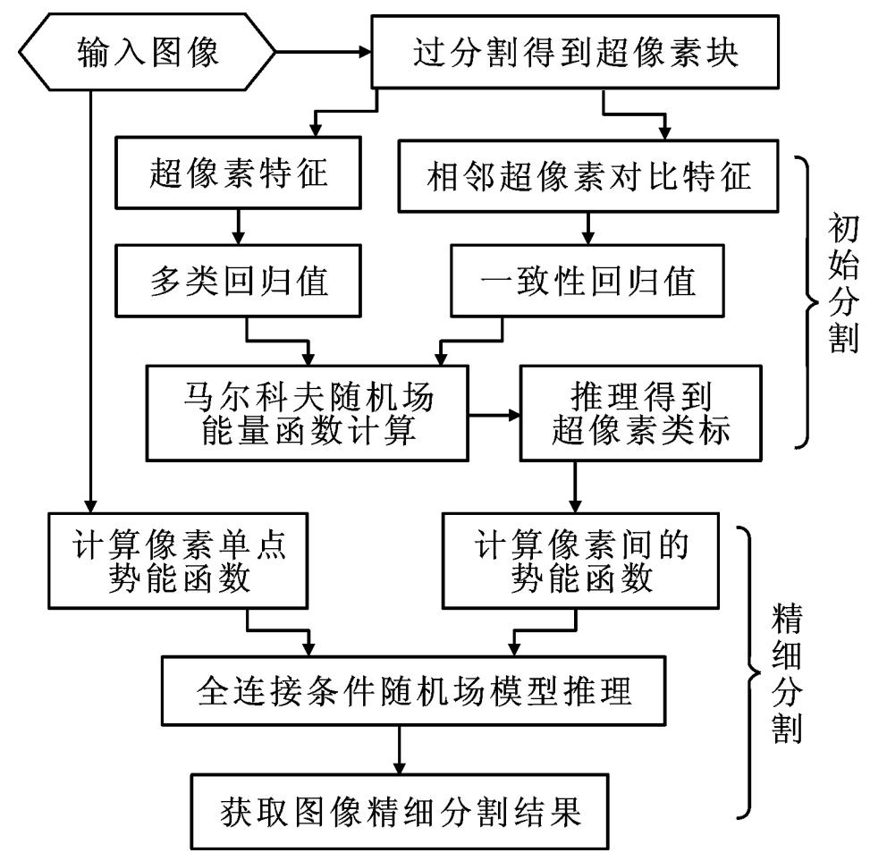
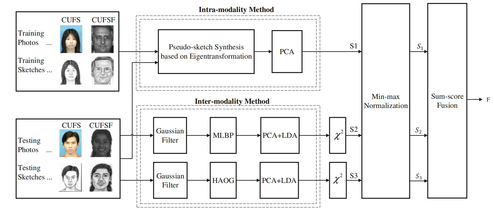

<a itemprop="sameAs" content="https://orcid.org/0000-0002-9423-9252" href="https://orcid.org/0000-0002-9423-9252" target="orcid.widget" rel="noopener noreferrer" style="vertical-align:top;">https://orcid.org/0000-0002-9423-9252</a>
   

## Attitude
From my own perspective, **mathematics** is the key technique for computer vision, machine learning and data science. Therefore, I will never stop learning **mathematics**. Only with solid mathematical background can we do **serious research** and make **significant contributions**. Here I recommend some excellent book to my friends.      
[1] Linear Algebra for Computer Vision, Robotics, and Machine Learning     
[2] Fundamentals of Optimization TheoryWith Applications to Machine Learning     
[3] Algebra, Topology, Differential Calculus, and Optimization Theory for Computer Science and Machine Learning    

## Biography
I'm Yang Liu (刘阳), a post-doctoral fellow at [HCP Lab](http://www.sysu-hcp.net/home/), [Sun-Yat-Sen University](http://www.sysu.edu.cn/) with co-advisor Prof. [Liang Lin](http://www.linliang.net/). Before that, I obtained my PHD degree in 2019 at [School of Telecommunications](http://ste.xidian.edu.cn/), [Xidian University](https://www.xidian.edu.cn/) advised by Prof. [Zhaoyang Lu](http://web.xidian.edu.cn/zhylu/). During my Ph.D study, I worked closely with Prof. [Jing Li](https://web.xidian.edu.cn/jingli/), Prof. [Tao Yang](http://teacher.nwpu.edu.cn/taoyang.html) and Dr. [Chao Yao](https://scholar.google.com/citations?user=n6w02qoAAAAJ&hl=en). Before that, I received my Bachelor Degree in telecommunications from the School of Information Engineering, [Chang’an University](http://www.chd.edu.cn/) in 2014. My current research interests include computer vision and machine learning.  

## News
08/2019:&nbsp;   One journal paper is published in IEEE TCSVT (JCR Rank 1, IF:4.046).   
08/2019:&nbsp;   I start working as a postdoctoral fellow at Sun-Yat-Sen University.       
07/2019:&nbsp;   I obtain my Ph.D degree from Xidian University.   
11/2018:&nbsp;   I am invited to give a talk at The Second Session of Telecommunication Bridge.  
10/2018:&nbsp;   I obtain the National Scholarship for PhD Students (30,000 RMB).    
07/2018:&nbsp;   I am invited to give a talk at a Postgraduate Symposium.   
06/2018:&nbsp;   One journal paper is published in IEEE SPL (JCR Rank 2, IF:3.268).  
02/2018:&nbsp;   One journal paper is published in Complexity (JCR Rank 1, IF:4.621).   
01/2018:&nbsp;   One journal paper is published in Journal of Xi'an Jiaotong University.  
08/2017:&nbsp;   One journal paper is published in Journal of Xi'an Jiaotong University.  
09/2016:&nbsp;   One conference paper is accepted by CCBR.  

## Research interests
Interpretable Human Action Understanding, Heterogenous Action Recognition  
Deep Learning, Transfer Learning, Domain Adaptation  
Cognitive Reasoning, Knowledge Graph Embedding, Graph Neural Networks  
Intelligent Transportation System  

## PhD thesis  
[Cross-domain Human Action Recognition via Transfer Learning](https://yangliu9208.github.io/home/). 1-142, 2019. (In Chinese)  

## Journal papers  

          <a>
            
          </a> 

Deep Image-to-Video Adaptation and Fusion Networks for Action Recognition  [[pdf]](https://yangliu9208.github.io/DIVAFN/)[[codes]](https://yangliu9208.github.io/DIVAFN/)          
**Yang Liu**, Zhaoyang Lu, Jing Li, Tao Yang, Chao Yao.    
**IEEE Transactions on Image Processing**, under revision.   

          <a>
            
          </a> 

Hierarchically Learned View-Invariant Representations for Cross View Action Recognition  [[pdf]](https://arxiv.org/abs/1809.00421)[[codes]](https://yangliu9208.github.io/JSRDA/)   
**Yang Liu**, Zhaoyang Lu, Jing Li, Tao Yang.  
**IEEE Transactions on Circuits and Systems for Video Technology**, vol. 29, no. 8, pp. 2416-2430, 2019.   

          <a>
            
          </a> 

Global Temporal Representation based CNNs for Infrared Action Recognition  [[pdf]](https://arxiv.org/abs/1909.08287)[[codes]](https://yangliu9208.github.io/TSTDDs/)    
**Yang Liu**, Zhaoyang Lu, Jing Li, Tao Yang, Chao Yao.   
**IEEE Signal Processing Letters**, vol. 25, no. 6, pp. 848-852, 2018.   

          <a>
            
          </a> 

Transferable Feature Representation for Visible-to-Infrared Cross-Dataset Human Action Recognition  [[pdf]](https://arxiv.org/abs/1909.08297)[[codes]](https://yangliu9208.github.io/CDFAG/)     
**Yang Liu**, Zhaoyang Lu, Jing Li, Chao Yao, Yanzi Deng.  
**Complexity**, vol. 2018, Article ID 5345241, 2018.    

           

A Geometric Segmentation Method for Traffic Scenes Using Super-Pixel Label Matching  [[pdf]](http://zkxb.xjtu.edu.cn//oa/darticle.aspx?type=view&id=201808012)     
Jiangce Hu, Zhaoyang Lu, Jing Li, Yanzi Deng, **Yang Liu**.  
**Journal of Xi'an Jiaotong University**, vol. 52, no. 8, pp. 74-79, 2018.  

          <a>
            
          </a> 

Road Scene Segmentation Using Hierarchical Graph-based Inference  [[pdf]](http://zkxb.xjtu.edu.cn/oa/DArticle.aspx?type=view&id=201712010)     
Yanzi Deng, Zhaoyang Lu, Jing Li, **Yang Liu.**  
**Journal of Xi'an Jiaotong University**, vol. 51, no. 12, pp. 62-67, 2017.  

## Conference papers 

          <a>
            
          </a> 

Combining Multiple Features for Cross-Domain Face Sketch Recognition  [[pdf]](https://link.springer.com/chapter/10.1007/978-3-319-46654-5_16)   
**Yang Liu**, Jing Li, Zhaoyang Lu,Tao Yang, Zijian Liu.  
**Chinese Conference on Biometric Recognition (CCBR)**, 2016: 139-146.   

## Patents (in Chinese) 
[1] 卢朝阳，邓顺，李静，**刘阳**，许琼. "一种对装有车载监控终端的车辆监控系统及其方法". 国家发明专利CN106600951B    
[2] 卢朝阳，许琼，李静，邓顺，**刘阳**. " 车辆监控系统的统计报表生成方法". 国家发明专利CN106682232A  

## Academic services 
Reviewer for   
IEEE Transactions on Cybernetics  
IEEE Transactions on Circuits and Systems for Video Technology  
International Conference on Computer Science and Application Engineering 2018  
Control and Decision  

## Selected honors & awards  
2018 National Scholarship for PhD Students  
2018 Excellent PhD Students      
2017 First Class Academic Scholarship for PhD Students  
2015 Second Class Academic Scholarship for Master Students   
2013 Third Prize of National English Competition   
2012 Second Prize in National Mathematical Modeling Contest

 
