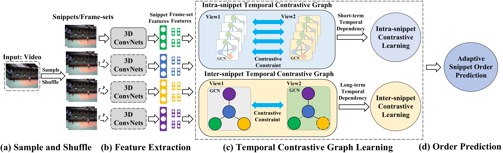
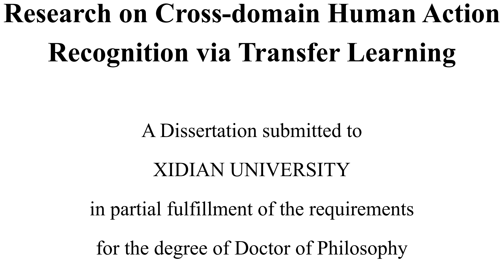

<a itemprop="sameAs" content="https://orcid.org/0000-0002-9423-9252" href="https://orcid.org/0000-0002-9423-9252" target="orcid.widget" rel="noopener noreferrer" style="vertical-align:top;">https://orcid.org/0000-0002-9423-9252</a>
   

## Biography ([CV](https://drive.google.com/file/d/1Q5dyiX7RWbashRSv-_U7NgtH3hqfy2q9/view?usp=sharing))
I'm Yang Liu (刘阳), a post-doctoral fellow at [HCP Lab](http://www.sysu-hcp.net/home/), School of Computer Science and Engineering, [Sun-Yat-Sen University](http://www.sysu.edu.cn/) with co-advisor Prof. [Liang Lin](http://www.linliang.net/). Before that, I obtained my Ph.D degree of Telecommunications and Information Systems in 2019 at [School of Telecommunications](http://ste.xidian.edu.cn/), [Xidian University](https://www.xidian.edu.cn/) advised by Prof. [Zhaoyang Lu](http://web.xidian.edu.cn/zhylu/). During my Ph.D study, I worked closely with Prof. [Jing Li](https://web.xidian.edu.cn/jingli/), Prof. [Tao Yang](https://scholar.google.com/citations?hl=en&user=Lvn4nH8AAAAJ) and Prof. [Chao Yao](https://scholar.google.com/citations?user=n6w02qoAAAAJ&hl=en). Before that, I received my Bachelor Degree in telecommunication from the School of Information Engineering, [Chang’an University](http://www.chd.edu.cn/) in 2014. I am the reviewers of some top journals, including IEEE Transactions on Neural Networks and Learning Systems, IEEE Transactions on Cybernetics, IEEE Transactions on Multimedia, IEEE Transactions on Circuits and Systems for Video Technology, IEEE Transactions on Human-Machine Systems, IEEE Signal Processing Letters, Pattern Recognition, Visual Computer, etc. I am also the reviewer for NSFC (National Natural Science Foundation of China). My current research interests include video analysis and understanding, self-supervised learning, transfer learning.   

## Research interests   
Video Analysis and Understanding, Human Action Recognition        
Transfer Learning, Multi-modal Representation Learning, Knowledge Distillation   
Deep Learning, Self-supervised Learning, Reinforcement Learning      

## News 
**2020-12:&nbsp; I am invitied as the reviewing expert for NSFC.**   
2020-11:&nbsp; I received the funding from National Natural Science Foundation of Guangdong Province of China.      
2020-09:&nbsp; I received the funding from National Natural Science Foundation of China.    
2020-09:&nbsp; Paper *Semantics-aware Adaptive Knowledge Distillation for Sensor-to-Vision Action Recognition* is [available](https://arxiv.org/abs/2009.00210).    
2020-06:&nbsp; I received the funding from China Postdoctoral Science Foundation.     
2020-03:&nbsp; I received the funding from Fundamental Research of the Central Universities.   
2020-01:&nbsp; My [Ph.D Thesis](https://pan.baidu.com/s/1-Co8GcHEa7A1rST6oe171g) (psw：ithd) is available now.     
2020-01:&nbsp; My Ph.D Thesis is published online in [CNKI](https://www.cnki.net/).     
2019-10:&nbsp; Codes and datasets for IEEE TIP is [available](https://yangliu9208.github.io/DIVAFN/).    
2019-10:&nbsp; One paper is accepted by IEEE Transactions on Image Processing.   
2019-08:&nbsp; I start working as a postdoctoral fellow at Sun-Yat-Sen University.       
2019-06:&nbsp; I obtain my Ph.D degree from Xidian University.   

## Research Projects (Hosting Fundings)  
1.&nbsp; National Natural Science Foundation of China, &yen; 300K, 2021-2024    
2.&nbsp; National Natural Science Foundation of Guangdong Province, &yen; 100K, 2021-2024    
3.&nbsp; General Program of China Postdoctoral Science Foundation, &yen; 80K, 2020-2022          
4.&nbsp; Fundamental Research Funds for the Central Universities, &yen; 120K, 2020-2022          

## Selected Publications (Journals & Conferences)

           

***Temporal Frequency Contrastive Graph for Self-supervised Video Understanding***          
**Yang Liu**, Liang Lin.      
**IEEE Transactions on Pattern Analysis and Machine Intelligence (preparing), 2021.**    
(*A frequency domain graph contrastive learning strategy to regard the inter-snippet and intra-snippet temporal relationships as self-supervision signals for temporal representation learning.*)   

           

***Temporal Contrastive Graph for Self-supervised Video Representation Learning***[[pdf]](https://arxiv.org/abs/2101.00820)[[codes]]( https://github.com/YangLiu9208/TCG)                    
**Yang Liu**, Keze Wang, Haoyuan Lan, Liang Lin.      
**IEEE/CVF Conference on Computer Vision and Pattern Recognition (Under Review), 2021.**        
(*A hybrid graph contrastive learning strategy to regard the inter-snippet and intra-snippet temporal relationships as self-supervision signals for temporal representation learning.*)   

           

***Semantics-aware Adaptive Knowledge Distillation for Sensor-to-Vision Action Recognition***[[pdf]](https://arxiv.org/abs/2009.00210)[[codes]]( https://yangliu9208.github.io/SAKDN/)                    
**Yang Liu**, Guanbin Li, Liang Lin.      
**IEEE Transactions on Image Processing (Under Review), 2020.**     
(*A novel end-to-end adaptive knowledge distillation framework for sensor-to-vision heterogenous action recognition problem.*)   

          <a>
            
          </a> 

***Deep Image-to-Video Adaptation and Fusion Networks for Action Recognition*** [[pdf]](https://ieeexplore.ieee.org/document/8931264/)[[codes]](https://yangliu9208.github.io/DIVAFN/)             
**Yang Liu**, Zhaoyang Lu, Jing Li, Tao Yang, Chao Yao.    
**IEEE Transactions on Image Processing, 2020. (CCF-A, JCR 1, IF:9.340)**   
(*A Novel Cross-modal Adaptation Framework that utilize image features to improve the performance of video action recognition.*)  

          <a>
            
          </a> 

***Hierarchically Learned View-Invariant Representations for Cross View Action Recognition*** [[pdf]](https://ieeexplore.ieee.org/document/8453034)[[codes]](https://yangliu9208.github.io/JSRDA/)     
**Yang Liu**, Zhaoyang Lu, Jing Li, Tao Yang.  
**IEEE Transactions on Circuits and Systems for Video Technology, 2019. (JCR 1, IF:4.133)**  
(*A Novel Cross-view Action Recognition Framework for learning view-invariant representations.*)  
  

          <a>
            
          </a> 

***Global Temporal Representation based CNNs for Infrared Action Recognition*** [[pdf]](https://ieeexplore.ieee.org/document/8332532)[[codes]](https://yangliu9208.github.io/TSTDDs/)          
**Yang Liu**, Zhaoyang Lu, Jing Li, Tao Yang, Chao Yao.   
**IEEE Signal Processing Letters, 2018.  (JCR 2, IF:3.105)**   
(*A novel Optical-flow stacked difference image is proposed to capture global temporal information for infrared action recognition.*)  

          <a>
            
          </a> 

***Transferable Feature Representation for Visible-to-Infrared Cross-Dataset Human Action Recognition*** [[pdf]](http://downloads.hindawi.com/journals/complexity/2018/5345241.pdf)[[codes]](https://yangliu9208.github.io/CDFAG/)[[XD145 dataset]](https://drive.google.com/drive/folders/0B1qfLiy9hTl6NUlHNFo1eFhzekU?usp=sharing)      
**Yang Liu**, Zhaoyang Lu, Jing Li, Chao Yao, Yanzi Deng.  
**Complexity, 2018. (JCR 2, IF:2.462)**      
(*The first work that uilize visible light videos as an aid to improve the infrared action recognition performance. And a visible light action dataset XD145 is built.*)   

          <a>
            
          </a> 

***Combining Multiple Features for Cross-Domain Face Sketch Recognition***[[pdf]](https://link.springer.com/chapter/10.1007/978-3-319-46654-5_16)        
**Yang Liu**, Jing Li, Zhaoyang Lu,Tao Yang, Zijian Liu.  
**Chinese Conference on Biometric Recognition (CCBR), 2016.**   
(*My first academic paper, which uses simple multi-feature fusion method to address cross-domain face sketch recognition problem.*)  

          <a>
            
          </a> 

***A Geometric Segmentation Method for Traffic Scenes Using Super-Pixel Label Matching***  
Jiangce Hu, Zhaoyang Lu, Jing Li, Yanzi Deng, **Yang Liu**.  
**Journal of Xi'an Jiaotong University, 2018.**  
(*My co-author paper for semantic segmentation in traffic scenes.*)   

          <a>
            
          </a> 

***Road Scene Segmentation Using Hierarchical Graph-based Inference***  
Yanzi Deng, Zhaoyang Lu, Jing Li, **Yang Liu.**  
**Journal of Xi'an Jiaotong University, 2017.**  
(*My co-author paper for semantic segmentation in traffic scenes.*)   

## PhD Thesis   

          <a>
            
          </a> 

***Cross-domain Human Action Recognition via Transfer Learning, 2019.*** [[pdf]](https://pan.baidu.com/s/1-Co8GcHEa7A1rST6oe171g)(psw：ithd) [[Defense Talk]]((https://yangliu9208.github.io/home/))    
**Yang Liu**    
**PhD thesis, Xidian University, June 30, 2019.**   
Committee: Zhaoyang Lu, Jing Li, Quanxue Gao, Peiyi Shen, Guizhong Liu, Chun Qi.    

## Patents (in Chinese) 
[1] 卢朝阳，邓顺，李静，**刘阳**，许琼. "一种对装有车载监控终端的车辆监控系统及其方法". 国家发明专利CN106600951B    

## Academic services 
**Reviewer for**   
IEEE Transactions on Neural Networks and Learning Systems   
IEEE Transactions on Cybernetics  
IEEE Transactions on Multimedia   
IEEE Transactions on Circuits and Systems for Video Technology   
IEEE Transactions on Human-Machine Systems    
IEEE Signal Processing Letters  
IEEE Access   
Pattern Recognition  
Visual Computer    
NSFC (National Natural Science Foundation of China)  

## Selected honors & awards  
2018 National Scholarship for PhD Students  
2018 Excellent PhD Students      
2017 First Class Academic Scholarship for PhD Students  
2015 Second Class Academic Scholarship for Master Students   
2013 Third Prize of National English Competition   
2012 Second Prize in National Mathematical Modeling Contest

## Skills
Program Language: Python, C++/C, Matlab, C#, PhP                   
Deep Learning Architecture: Pytorch, Caffe, MatConvNet               
English Level: CET-6 597           

 
